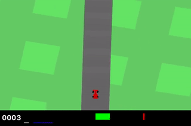
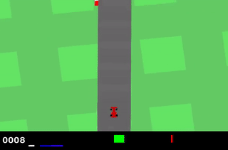

# Applying Transformer Architecture to classical car-driving RL tasks

This project investigates the application of transformer architectures in classical car-driving reinforcement learning tasks.

## Demonstration

The project has led to improvements in the Hugging Face Decision Transformer, allowing it to process visual inputs and discrete actions. Major steps included training a basic Deep Q-Network (DQN) to explore Gym CarRacing V2 the environment, creating an offline dataset, and further training of the Decision Transformer with this data.

| DQN (Deep Q Learning) | Visual Decision Transformer |
| --------------------- | --------------------------- |
|  |  |
| DQN Training | VDT Training |
| Generating Offline Datasewt |  |

## Classic RL Algorithms

...

## Transformers in RL 

...