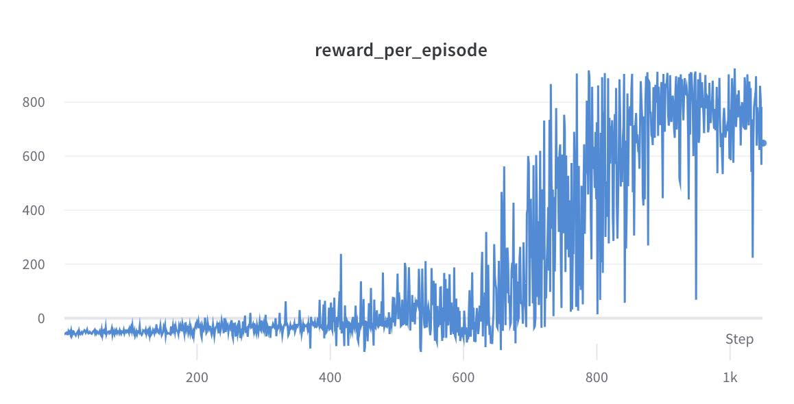
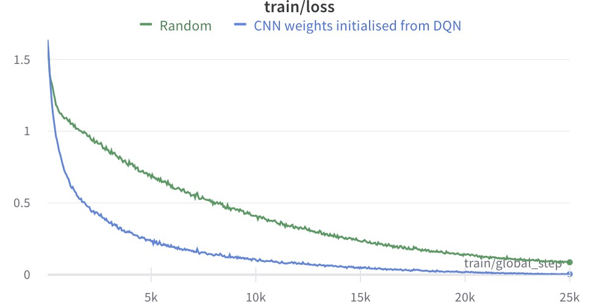

# Applying Transformer Architecture to classical car-driving RL tasks

This project investigates the application of transformer architectures in classical car-driving reinforcement learning tasks.

## Demonstration

The project has led to improvements in the Hugging Face Decision Transformer, allowing it to process visual inputs and discrete actions. Major steps included training a basic Deep Q-Network (DQN) to explore Gym CarRacing V2 the environment, creating an offline dataset, modifying and further training of the Decision Transformer with this data.


| Driver: Deep Q Learning  | Driver: Visual Decision Transformer |
| --------------------- | --------------------------- |
|  |  |
| DQN Training [](https://colab.research.google.com/github/YakivGalkin/cnn_decision_transformer/blob/main/DQN_train.ipynb) | VDT Training [](https://colab.research.google.com/github/YakivGalkin/cnn_decision_transformer/blob/main/VDT_train.ipynb) |

Using DQN to explore environment and Generating Offline Dataset [](https://colab.research.google.com/github/YakivGalkin/cnn_decision_transformer/blob/main/DQN_generate_dataset.ipynb)  

Evaluating DQN & VDT, video recording [](https://colab.research.google.com/github/YakivGalkin/cnn_decision_transformer/blob/main/demo_video.ipynb)  


## Transformers in RL 

A good overview of Transformer Architecture applications in RL can be found in the paper:
[A Survey on Transformers in Reinforcement Learning](https://arxiv.org/abs/2301.03044).

Two primary uses of transformers are:
- Representation Learning
- Sequential Decision-making

In the scope of this project, I decided to focus on Sequential Decision-making.
One of the first papers in this regard was [Offline Reinforcement Learning as One Big Sequence Modeling Problem](https://arxiv.org/abs/2106.02039).
As part of the experiments, the authors implemented a Trajectory Transformer that tokenize/discretizes all continuous values (a quantile discretizer was used by default) and then trained it on a sequence of states, actions, and rewards. 


As a result, the transformer learns common behavior (imitation learning) from offline training data. Later, by using beam search as a limited horizon reward-maximising procedure, the Trajectory Transformer can predict the best trajectory based on past experience.
For image-based observations, this model doesn't seem appropriate as it heavily relies on discretization.

Next, I paid attention to the paper:
[Decision Transformer: Reinforcement Learning via Sequence Modeling](https://arxiv.org/abs/2106.01345).
The key idea of the Decision Transformer was to replace the reward in the trajectory transformer with the future cumulative reward (often called return). By conditioning a pre-trained transformer with a desired future return, it can predict the best trajectories that should achieve it. 


The authors also discovered that knowledge of the possible future return is important when using their approach.

The HuggingFace community has already included the Decision Transformer as part of their transformers library:
[Transformers Model Doc: Decision Transformer](https://huggingface.co/docs/transformers/model_doc/decision_transformer).
Unfortunately, their implementation is strictly dedicated to continuous state and action spaces, with a comment "image-based states will come soon". Implementing this for image-based states sounds like a good challenge, which becomes **the purpose of this project, which I have named Visual Decision Transformer**. 

### Implementing Visual Decision Transformer

Exploration from the paper "A Survey on Transformers" states, "Interestingly, to the best of our knowledge, we do not find related works about learning DT in the pure online setting without any pre-training. We suspect that this is because pure online learning will exacerbate the non-stationary nature of training data, which will severely harm the performance of the current DT policy. Instead, offline pre-training can help to warm up a well-behaved policy that is stable for further online training." So, as a first step, we need to build an offline dataset by exploring the environment with one of the classic RL algorithms.

As a result, the major steps become:
- Reviewing/choosing a classic RL algorithm/model for exploration of the CarRacingV2 environment
- Training the chosen classic RL model on the environment
- Building a dataset, storing it for future use
- Modifying HuggingFace's decision transformer to support image data and discrete actions
- Training the Visual Decision Transformer
- Evaluation, comparison, and experiments.

## Choosing a Classic RL Algorithm

[](https://colab.research.google.com/github/YakivGalkin/cnn_decision_transformer/blob/main/DQN_train.ipynb)

Since I decided to use a discrete action space, Deep Q-learning seems to be a good option. Instead of implementing the model, replay buffer, and training cycle from scratch, it is possible to use the `stable_baselines3` Python library, which already has built-in implementations of most popular classic RL algorithms - DQN, PPO, SAC, etc.

Thus, our training code is now reduced to two lines of Python code - model initialization and training:

```python
from stable_baselines3 import DQN
from stable_baselines3.dqn.policies import CnnPolicy

model = DQN(CnnPolicy, env, verbose=1, buffer_size=config["BUFFER_SIZE"], learning_starts=config["LEARNING_STARTS"], tensorboard_log="./tensorboard/")

model.learn(total_timesteps=config["NUM_OF_STEPS"]*config["NUM_OF_EPISODES"], log_interval=config["LOG_INTERVAL"], callback=DQNCustomCallback())
```


The chart below demonstrates the model's evaluation results (cumulative reward) during the learning process. As we can see, the moving average approaches 900, which is considered a very good ride.




## Building an Offline Dataset

[](https://colab.research.google.com/github/YakivGalkin/cnn_decision_transformer/blob/main/DQN_generate_dataset.ipynb)  

For offline dataset storage, I have chosen the HDF5 file format. One candidate was the Hugging Face Dataset with its Apache Arrow persistence layer, but it consumed more memory and worked more slowly. Since most of the work was done in Google Colab, Google Cloud Storage was chosen to organically fit into the infrastructure.

## Making the Decision Transformer "Visual"
The HuggingFace implementation of the Decision Transformer has hardcoded embedding layers for states and actions. My only option was to clone the sources and modify them. The changes were straightforward—utilize a CNN encoder for images. Additionally, when transitioning from a continuous to a discrete action space, it was necessary to change the loss function from MSE to cross-entropy.

## Training the Visual Decision Transformer

[](https://colab.research.google.com/github/YakivGalkin/cnn_decision_transformer/blob/main/VDT_train.ipynb)

To expedite training, I decided to "borrow" weights from a pre-trained DQN and use them for the initialisation of the image encoder in the transformer. The chart below demonstrates the difference in the speed of learning between using random weights in the convolutional layers and using weights taken from the DQN.


